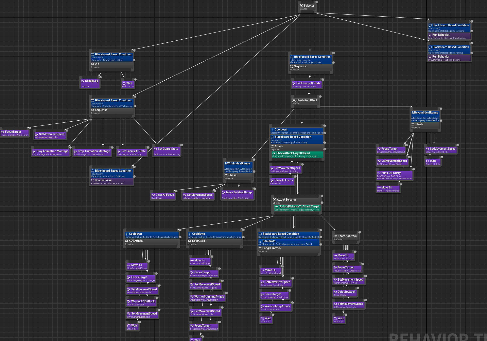
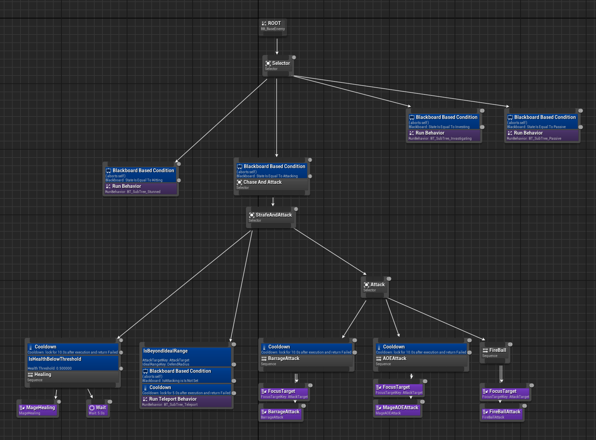
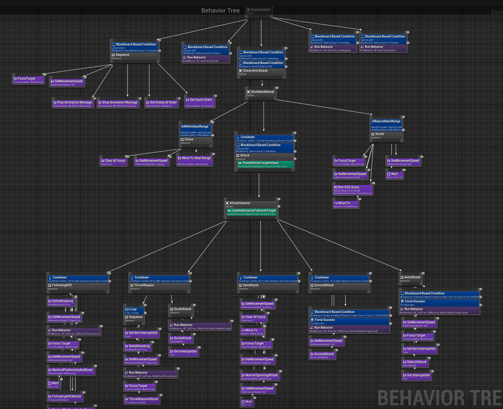
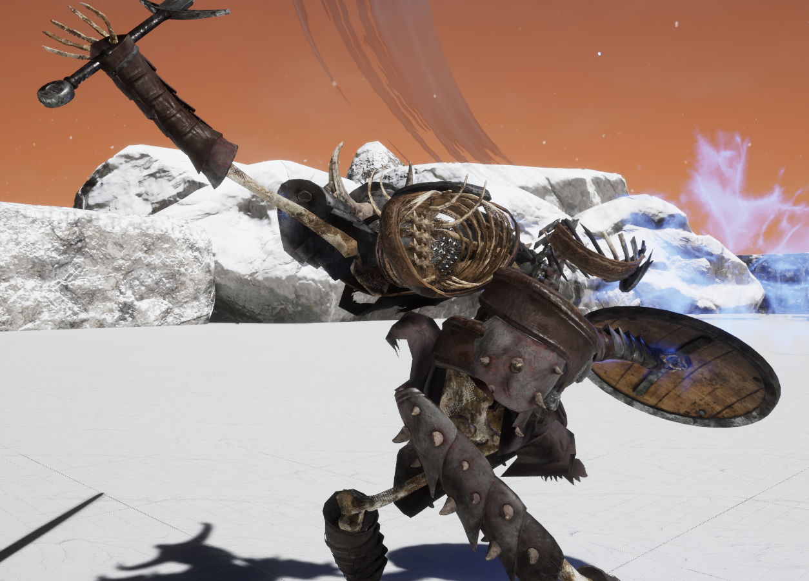
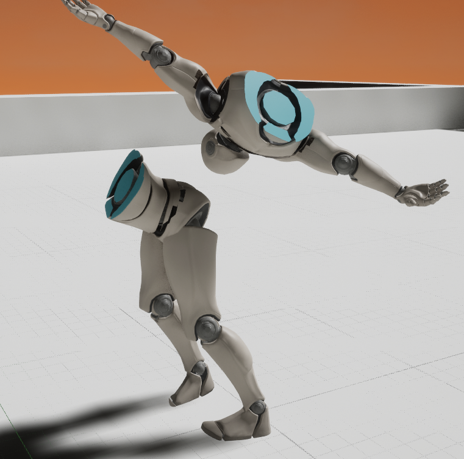

## Slash
- **Slash**는 **<u>액션 어드벤처</u>** 게임을 제작하기 위해서 만든 프로젝트입니다.   
- Main Character의 기능 뿐만 아니라 Behavior Tree를 이용한 Enemy AI도 제작하였습니다.   
- Animation을 제외한 대부분의 기능을 C++로 직접 제작하였습니다.
- 아래 링크를 통해서 구현한 작업의 동영상을 보실 수 있습니다.

  

## 🛠 제작한 기능   
**Main Character(Player) 기능**
- 
- Player의 공격 System(Auto Attack, Guard, Bow)를 개발했습니다.
- Parry 및 Perfect Dodge 기능을 추가하여 전투시스템을 개선했습니다.
- Bow에는 HeadShot 기능을 추가하여 Bow 사용 시 타격감을 향상했습니다.
- Foot IK를 적용하여 지형에 따라 자연스럽게 발 위치를 나타냈습니다.   
🔗 [기본 AttackSystem 동영상](https://youtu.be/UAxGaGG28A8)

  

**Enemy AI**
-
### Warrior AI
- Player를 인지하고 일정 범위 내에 들어오면 EQS를 활용해 Point를 생성하여 Strafe합니다.
- Auto Attack, Jump Attack, Spin Attack, Area Attack 중 Behavior Tree에서 조건에 알맞은 공격을 수행합니다.
- Warrior는 Player를 인지한 뒤에는 Player의 화살을 Guard합니다.  
🔗 [Warrior AI 동영상 링크](https://youtu.be/VgVmefSfWQw)

 Warrior Behavior Tree Image

 

---
### Mage AI
- Mage는 FireBallAttack으로 Player에게 발사하는 공격과   
Barrage Attack으로 Player 근처로 구체를 5개 발사하는 공격을 합니다.
- Mage는 Player가 가까이 다가오면 Player의 뒤쪽 방향으로 Teleport합니다.  
Teleport에서 돌아올 때 Niagara를 사용해서 Mage의 모습을 Effect로 보이게 하여 Player가 다시 나타나는 것을 인지할 수 있도록 하였습니다.
- Mage의 피가 절반 이하로 떨어지면 Healing을 합니다.  
🔗 [Mage AI 동영상 링크](https://www.youtube.com/watch?v=G_tvOR-PAdw)

 Mage Behavior Tree Image

 

---
### Warlord AI
- Warlord는 Warrior의 Jump Attack을 제외한 공격과 Throw Weapon, Floating 공격을 수행합니다.
- Throw Weapon은 3번 수행 후 Player에게 다가와서 공격합니다. 
- Floating 공격은 Animation Montage가 끝나기 전에 화살로 공격하지 못하면 Player를 따라다니는 지속 공격을 수행합니다  
🔗 [Warlord AI 동영상 링크](https://www.youtube.com/watch?v=38p8q2axx-0)

 Warlord Behavior Tree Image

 

  

**Slice Mesh**
-
- Procedural Mesh를 BeginPlay시에 BackgroundThread에서 Skeletal Mesh의 Vertice를 수집한 후 Die시 일정 부분(지정한 Bone 근처)만 Procedural Mesh를 생성하여 Slice합니다.
- 해당 방법으로 Break Bone으론 표현 불가능한 단면 표현이 가능합니다.  
  또한 Procedural Mesh를 Slice만 하였을 때 발생하는 원치 않는 부분도 Slice하는 현상이 발생하지 않으며 Ragdoll을 활용한 사망 연출도 가능합니다.
- 멀티 쓰레딩을 활용하여 BeginPlay시 부담을 줄여줍니다.  
  (Enemy 100마리 Test시 2.2s->315.2ms로 85.67% 개선)  
🔗[Slice 구현 블로그 포스팅 링크](https://daisy0461.tistory.com/169)

 #### Slice Image

 

  
  

